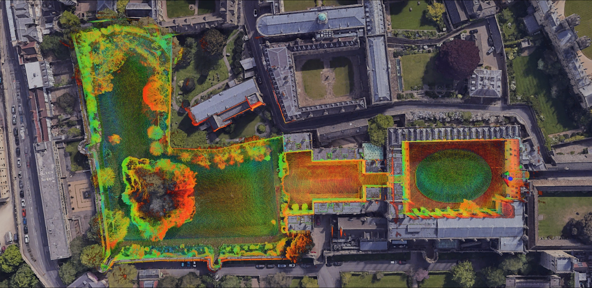
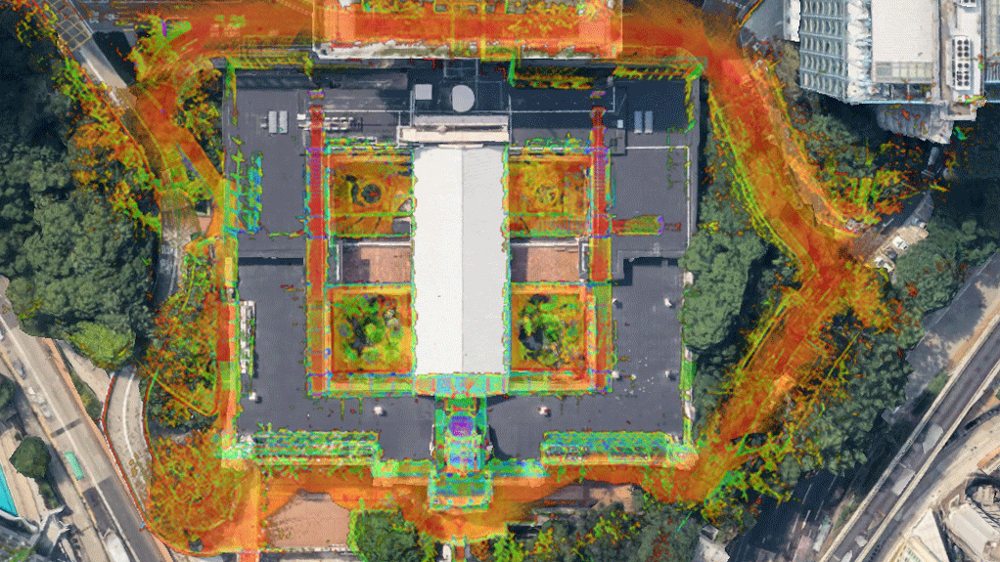

# iG-LIO

**The code will be released once the paper is accepted.**

**Time line**

| Time         | Event                                                        |
| ------------ | ------------------------------------------------------------ |
| Aug 13, 2023 | **😀** Paper submitted to IEEE Robotics and Automation Letters (RA-L) |
| Nov 5, 2023  | **😭** Revise and resubmit                                    |
| Dec 22, 2023 | **🥳** Paper accepted for publication in RA-L                 |
| Current      | **🎉** Waiting for final publication and then releasing the source code |

This work proposes an incremental Generalized Iterative Closest Point (GICP) based tightly-coupled LiDAR-inertial odometry (LIO), iG-LIO, which addresses the challenges of integrating GICP into real-time LIO. The main contributions are as follows.

- The GICP constraints are tightly-coupled IMU constraints in a Maximum A Posteriori (MAP) estimation.
- A voxel-based surface covariance estimator (VSCE) is proposed to improve the efficiency and accuracy of the surface covariance estimation. Compared to the kd-tree based methods, VSCE reduces processing time in dense scans while maintaining the accuracy of iG-LIO in sparse and small FOV scans.
- An incremental voxel map is designed to represent the probabilistic models of surrounding environments. Compared to non-incremental methods (e.g., DLIO), it successfully reduces the time cost required for the nearest neighbor search and map management.
- Extensive datasets collected from different FOV LiDARs are adopted to evaluate the efficiency and accuracy of the proposed iG-LIO. Even though iG-LIO keeps identical parameters across all datasets, the results show that it is more efficient than Faster-LIO and achieves competitive performance compared to state-of-the-art LIO systems.

The experiment video can be found on **[YouTube ](https://www.youtube.com/watch?v=VyGc3_tXFSg&t=1s), [bilibili](https://www.bilibili.com/video/BV1fj411X7U6/?vd_source=a23d841c4ace01eddfe9603b21e7891f)** (update new video when final publication).

## 1. Build

### 1.1 Docker Container

### 1.2 Build from source

## 2. Run
### 2.1 NCLT Dataset
### 2.2 NCD Dataset
### 2.3 ULHK Dataset
### 2.4 AVIA Dataset
### 2.5 Botanic Garden Dataset
### 2.6 Run with your own dataset

## 3. Details about all sequences in the paper

We use abbreviations for all sequences due to limited space. The full names of all sequences are presented below.

| Abbreviation |                      Name                      | Distance(km) |         Sensor Type          |
| :----------: | :--------------------------------------------: | :----------: | :--------------------------: |
|    nclt_1    |                   2012-01-15                   |     7.58     |       Velodyne HDL-32E       |
|    nclt_2    |                   2012-04-29                   |     3.17     |       Velodyne HDL-32E       |
|    nclt_3    |                   2012-05-11                   |     6.12     |       Velodyne HDL-32E       |
|    nclt_4    |                   2012-06-15                   |     4.09     |       Velodyne HDL-32E       |
|    nclt_5    |                   2013-01-10                   |     1.14     |       Velodyne HDL-32E       |
|    ncd_1     |              01_short_experiment               |     1.61     |        Ouster OS1-64         |
|    ncd_2     |               02_long_experiment               |     3.06     |        Ouster OS1-64         |
|    ncd_3     |             05_quad_with_dynamics              |     0.48     |        Ouster OS1-64         |
|    ncd_4     |              06_dynamic_spinning               |     0.09     |        Ouster OS1-64         |
|    ncd_5     |               07_parkland_mound                |     0.70     |        Ouster OS1-64         |
|     bg_1     |                    1006-01                     |     0.76     | Velodyne VLP-16 & Livox AVIA |
|     bg_2     |                    1008-03                     |     0.74     | Velodyne VLP-16 & Livox AVIA |
|    avia_1    |                hku_main_buiding                |     0.96     |          Livox AVIA          |
|    avia_2    | outdoor_Mainbuilding_100Hz_2020-12-24-16-46-29 |     0.14     |          Livox AVIA          |
|    avia_3    |     outdoor_run_100Hz_2020-12-27-17-12-19      |     0.09     |          Livox AVIA          |

## 4. Mapping Results

We aligned the mapping results of iG-LIO with Google Earth and found that iG-LIO retains global consistency maps.

### NCLT 2012-05-11

### Newer College Dataset 02_long_experiment

### hku_main_building

## 5. Paper
Thanks for citing iG-LIO (RA-L 2024) if you use any of this code.

## 6. Acknowledgements

Thanks for the below great open-source project for providing references to this work.

1. LOAM (J. Zhang and S. Singh. LOAM: Lidar Odometry and Mapping in Real-time)
2. [FAST-LIO](https://github.com/hku-mars/FAST_LIO)
3. [Faster-LIO](https://github.com/gaoxiang12/faster-lio)
4. [LINS](https://github.com/ChaoqinRobotics/LINS---LiDAR-inertial-SLAM)
5. [SLICT](https://github.com/brytsknguyen/slict)

Thanks for the following public dataset.

1. [NCLT](http://robots.engin.umich.edu/nclt/)
2. [Newer College Dataset](https://ori-drs.github.io/newer-college-dataset/)
3. [Botanic Garden](https://github.com/robot-pesg/BotanicGarden)
4. [R3live](https://github.com/ziv-lin/r3live_dataset)

